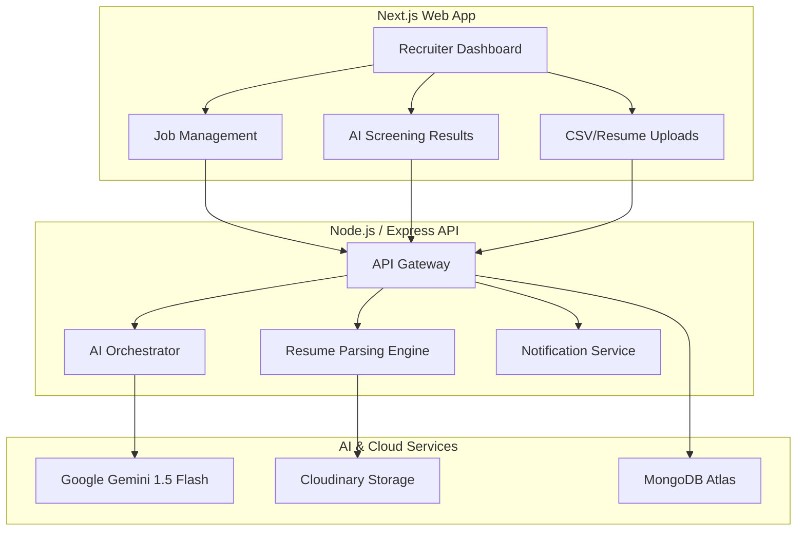

# 🚀 HRAI: The Future of AI-Driven Talent Screening

[](https://umurava.africa)
[](https://ai.google.dev/)

Welcome to **HRAI**, an innovation challenge prototype built to revolutionize the Human Resources industry. HRAI is a production-ready, AI-powered talent screening tool that solves the "Volume Problem"—helping recruiters objectively shortlist the top 10% of talent from thousands of applications while keeping **Humans in the Loop**.

---

## 📖 Project Overview
Recruiters today are overwhelmed by high application volumes and the difficulty of comparing candidates across diverse formats. **HRAI** solves this by:
1.  **Analyzing multiple applicants at once** using a single, high-context AI prompt.
2.  **Bridging the gap** between structured talent profiles and unstructured PDF/DOCX resumes.
3.  **Providing Explainable AI**: Not just a score, but a detailed breakdown of strengths, gaps, and relevance.

---

## 🏗️ System Architecture



---

## 🤖 AI Decision Flow (The "Brain")
Our AI logic is designed for **transparency and accuracy**. Here is how HRAI makes a decision:

1.  **Context Construction**: The system gathers the Job Description, required skills, experience level, and the recruiter's optional "AI Blueprint".
2.  **Data Harmonization**: It combines structured data (from the platform) with unstructured data (parsed from PDF resumes).
3.  **Prompt Engineering**: A carefully crafted prompt (Intentional Prompting) instructs Gemini to act as an "Executive Technical Recruiter".
4.  **Multi-Candidate Evaluation**: Gemini evaluates all candidates in parallel, assigning a **Match Score** and identifying specific **Strengths** and **Gaps**.
5.  **Ranked Shortlist**: The model returns a structured JSON ranked list, which is then persisted to the database and visualized for the recruiter.

---

## 🛠️ Setup & Installation

### 📋 Prerequisites
- Node.js v18+
- MongoDB Instance
- Google Gemini API Key
- Cloudinary Account (for resume uploads)

### 1. Clone the Monorepo
```bash
git clone https://github.com/mugishastev/frontendHRAI.git
cd HRAI
```

### 2. Environment Configuration
Create a `.env` file in the **backend** directory:
```env
PORT=5000
MONGODB_URI=your_mongodb_uri
JWT_SECRET=your_secret_key
GEMINI_API_KEY=your_gemini_key
CLOUDINARY_CLOUD_NAME=your_name
CLOUDINARY_API_KEY=your_api_key
CLOUDINARY_API_SECRET=your_secret
```

Create a `.env.local` file in the **frontend** directory:
```env
NEXT_PUBLIC_API_URL=http://localhost:5000/api
```

### 3. Run Development Environment
```bash
# Terminal 1: Backend
cd backend && npm install && npm run dev

# Terminal 2: Frontend
cd frontend && npm install && npm run dev
```

---

## 📜 Assumptions & Limitations
- **File Formats**: Current parsing supports PDF and DOCX. Legacy `.doc` files may have reduced accuracy.
- **Batch Size**: For optimal Gemini performance, bulk uploads are recommended in batches of up to 100 candidates.
- **Human Oversight**: The AI provides recommendations; final hiring decisions must be made by a recruiter via the "Accept" or "Reject" controls.

---

## 🛡️ Engineering Quality
- **Type Safety**: Built 100% with TypeScript across the stack.
- **Scalability**: Stateless API design ready for containerization.
- **Premium UX**: Glassmorphic UI with real-time feedback and state management via Redux Toolkit.

---

## 👥 The Sohoza Team
Developed with passion by: **Steven, Musa, Aliance, Mugisha, and Nadia**.

---
*Built for the Umurava AI Hackathon 2026. Empowering the next generation of African talent.*
